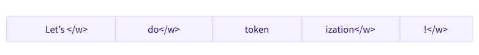

# 第二章 使用Transformers


## 介绍

​		Transformers模型通常非常大。由于有数百万到数百*亿*个参数，训练和部署这些模型是一项复杂的任务。此外，随着新模型几乎每天都在发布，并且每个模型都有自己的实现，因此尝试它们并非易事。

​		创建Transformer库就是为了解决这个问题。它的目标是提供一个单一的API，通过该API可以加载、训练和保存任何Transformer模型。该库的主要功能是：

+ **易于使用**：只需两行代码即可下载，加载和使用最先进的NLP模型进行推理。
+ **灵活性**：从本质上讲，所有模型都是简单的PyTorch`nn.Module`或TensorFlow`tf.keras.Model`类，可以像在各自的机器学习（ML）框架中的任何其他模型一样进行处理。
+ **简单：**整个库中几乎没有任何抽象。“All in one file”是一个核心概念：模型的正向传递完全定义在单个文件中，因此代码本身是可理解和可破解的。

​		最后一个功能使Transformers与其他ML库完全不同。这些模型不是建立在跨文件共享的模块之上的。相反，每个模型都有自己的层。除了使模型更易于接近和理解之外，这还允许您轻松地在一个模型上进行试验，而不会影响其他模型。

​		本章将从一个端到端示例开始，在该示例中，我们将model和tokenizer一起使用来复制第 1 章中介绍的`pipeline()`功能。接下来，我们将讨论model  API：我们将深入研究模型和配置类，并向您展示如何加载模型以及它如何处理数值输入到输出预测。

​		然后，我们将查看tokenizer  API，它是该`pipeline()`函数的另一个主要组件。Tokenizers 负责第一个和最后一个处理步骤，处理神经网络从文本到数字输入的转换，并在需要时转换回文本。最后，我们将向您展示如何处理在准备好的批处理中通过模型发送多个句子，然后通过仔细查看高级`tokenizer()`函数来总结所有内容。


## pipeline后面

​		让我们从一个完整的示例开始，看看当我们在第1章中执行以下代码时，幕后发生了什么：

```python
from transformers import pipeline

classifier = pipeline("sentiment-analysis")
print(classifier(
    [
        "I've been waiting for a HuggingFace course my whole life.",
        "I hate this so much!",
    ]
))
```

运行结果：

```python
[{'label': 'POSITIVE', 'score': 0.9598047137260437},
 {'label': 'NEGATIVE', 'score': 0.9994558095932007}]
```

​		正如我们在第 1 章中看到的，此管道将三个步骤组合在一起：预处理、通过模型传递输入和后处理：


让我们快速浏览一下其中的每一个。

### 使用tokenizer进行预处理

​		与其他神经网络一样，Transformer模型不能直接处理原始文本，因此我们管道的第一步是将文本输入转换为模型可以理解的数字。为此，我们使用*tokenizer*，它将负责：

+ 将输入拆分为称为*tokens*的单词、子单词或符号（如标点符号）
+ 将每个token映射到一个整数
+ 添加可能对模型有用的其他输入

​		所有这些预处理都需要以与预训练模型时完全相同的方式完成，因此我们首先需要从[模型中心](https://huggingface.co/models)下载该信息。为此，我们使用`AutoTokenizer`类及其`from_pretrained()`方法。使用我们模型的检查点名称，它将自动获取与模型的分词器关联的数据并将其缓存（因此仅在您第一次运行以下代码时下载）。

​		由于`sentiment-analysis`管道的默认检查点是`distilbert-base-uncased-finetuned-sst-2-english`（您可以[在此处](https://huggingface.co/distilbert-base-uncased-finetuned-sst-2-english)查看其模型卡），因此我们运行以下命令：

```python
from transformers import AutoTokenizer

checkpoint = "distilbert-base-uncased-finetuned-sst-2-english"
tokenizer = AutoTokenizer.from_pretrained(checkpoint)
```

​		一旦我们有了tokenizer，我们就可以直接将我们的句子传递给它，我们将得到一个字典，该字典已准备好提供给我们的模型！唯一要做的就是将输入 ID 列表转换为张量。

​		您可以使用 Transformers，而不必担心哪个ML框架用作后端;它可能是PyTorch或TensorFlow，或者某些模型的Flax。但是，Transformer模型只接受*张量*作为输入。如果这是您第一次听说张量，则可以将它们视为NumPy数组。NumPy 数组可以是标量 （0D）、矢量 （1D）、矩阵 （2D） 或具有更多维度。它实际上是一个张量;其他ML框架的张量行为类似，并且通常像NumPy数组一样易于实例化。

​		为了指定我们想要返回的张量类型（PyTorch，TensorFlow或普通的NumPy），我们使用`return_tensors`参数：

```python
raw_inputs = [
    "I've been waiting for a HuggingFace course my whole life.",
    "I hate this so much!",
]
inputs = tokenizer(raw_inputs, padding=True, truncation=True, return_tensors="pt")
print(inputs)
```

​		不要担心填充和截断;我们稍后会解释这些。这里要记住的主要事情是，您可以传递一个句子或句子列表，以及指定要返回的张量类型（如果没有传递类型，您将获得列表列表）。

以下是PyTorch张量的结果：

```python
{
    'input_ids': tensor([
        [  101,  1045,  1005,  2310,  2042,  3403,  2005,  1037, 17662, 12172, 2607,  2026,  2878,  2166,  1012,   102],
        [  101,  1045,  5223,  2023,  2061,  2172,   999,   102,     0,     0,     0,     0,     0,     0,     0,     0]
    ]), 
    'attention_mask': tensor([
        [1, 1, 1, 1, 1, 1, 1, 1, 1, 1, 1, 1, 1, 1, 1, 1],
        [1, 1, 1, 1, 1, 1, 1, 0, 0, 0, 0, 0, 0, 0, 0, 0]
    ])
}
```

​		输出本身是一个包含两个键`input_ids`和 `attention_mask`的字典。 包含两行整数（每个句子一行），它们是每个句子中标记的唯一标识符。我们将在本章后面解释它们是什么。


### 浏览模型

​		我们可以下载预训练模型，就像我们使用分词器一样。 Transformers 提供了一个`AutoModel`类，该类还具有一个`from_pretrained()`方法：

```python
from transformers import AutoModel

checkpoint = "distilbert-base-uncased-finetuned-sst-2-english"
model = AutoModel.from_pretrained(checkpoint)
```

​		在此代码片段中，我们下载了之前在pipeline中使用的相同检查点（它实际上应该已经缓存），并使用它实例化了模型。

​		此体系结构仅包含基本 Transformer 模块：给定一些输入，它输出我们称之为*隐藏状态（*也称为*功能）的内容*。对于每个模型输入，我们将检索一个高维向量，该向量表示 **Transformer 模型对该输入的上下文理解**。

​		如果这没有意义，请不要担心。我们稍后会解释这一切。

​		虽然这些隐藏状态本身很有用，但它们通常是模型另一部分（称为*头部*）的输入。在第1章中，不同的任务可以使用相同的体系结构执行，但是这些任务中的每一个都有一个与之关联的不同头。


### 高维向量?

Transformer 模块的矢量输出通常很大。它通常有三个维度：

+ **批大小**：一次处理的序列数（在我们的示例中为 2）。
+ **序列长度**：序列的数字表示形式的长度（在我们的示例中为 16）。
+ **隐藏大小**：每个模型输入的矢量维度。

​		它被称为“高维”，因为最后一个值。隐藏大小可能非常大（768对于较小的模型很常见，在较大的模型中，这可以达到3072或更多）。

如果我们将预处理的输入提供给模型，我们可以看到这一点：

```python
outputs = model(**inputs)
print(outputs.last_hidden_state.shape)
```

运行结果：

```python
torch.Size([2, 16, 768])
```

​		请注意，Transformer模型的输出的行为类似于`namedtuples` 或字典。您可以通过属性（就像我们所做的那样）或键（`outputs["last_hidden_state"]`）甚至按索引访问元素，如果您确切地知道要查找的内容的位置，则可以访问元素(`outputs[0]`)。


### 模型头：从数字中理解

​		模型头将隐藏状态的高维向量作为输入，并将它们投影到不同的维度上。它们通常由一个或几个线性层组成：


​		Transformer模型的输出直接发送到模型头进行处理。

​		在此图中，模型由其嵌入层和后续层表示。嵌入层将标记化输入中的每个输入 ID 转换为表示关联token的向量。随后的层使用注意力机制操纵这些向量，以产生句子的最终表示。


Transformer中有许多不同的架构，每个架构都是围绕处理特定任务而设计的。以下是一个非详尽的列表：

- `*Model` (检索隐藏状态)
- `*ForCausalLM`
- `*ForMaskedLM`
- `*ForMultipleChoice`
- `*ForQuestionAnswering`
- `*ForSequenceClassification`
- `*ForTokenClassification`
- and others 

​		现在，如果我们看一下输入的形状，维度会低得多：模型头将我们之前看到的高维向量作为输入，并输出包含两个值的向量（每个标签一个）：

```python
print(outputs.logits.shape)
```

运行结果：

```python
torch.Size([2, 2])
```

​		由于我们只有两个句子和两个标签，因此我们从模型中获得的结果是形状为2 x 2。


### 对输出进行后处理

​		我们从模型中获得的输出值本身并不一定有意义。让我们来看看：

```python
print(outputs.logits)
```

运行结果：

```python
tensor([[-1.5607,  1.6123],
        [ 4.1692, -3.3464]], grad_fn=<AddmmBackward>)
```

​		我们的模型预测了第一句话`[-1.5607, 1.6123]`和第二句话`[ 4.1692, -3.3464]`。这些不是概率，而是 *logits*，即模型最后一层输出的原始、非规范化分数。要转换为概率，它们需要经过SoftMax层（所有Transformers模型都输出logits，因为用于训练的损失函数通常会将最后一个激活函数（例如SoftMax）与实际的损失函数（例如交叉熵）融合在一起）：

```python
import torch

predictions = torch.nn.functional.softmax(outputs.logits, dim=-1)
print(predictions)
```

运行结果：

```python
tensor([[4.0195e-02, 9.5980e-01],
        [9.9946e-01, 5.4418e-04]], grad_fn=<SoftmaxBackward>)
```

​		现在我们可以看到模型预测了第一句话[0.0402, 0.9598]和第二句话[0.9995, 0.0005]。这些是可识别的概率分数。

​		要获得与每个位置对应的标签，我们可以检查模型配置的 id2label 属性（下一节中将对此进行详细介绍）：

```python
model.config.id2label
```

运行结果：

```python
{0: 'NEGATIVE', 1: 'POSITIVE'}
```

现在我们可以得出结论，该模型预测了以下内容：

+ 第一句：否定：0.0402，正数：0.9598
+ 第二句：否定：0.9995，正：0.0005

​		我们已经成功地重现了pipeline的三个步骤：使用分词器进行预处理，通过模型传递输入以及后处理！现在，让我们花一些时间更深入地研究这些步骤中的每一个。


## 模型


​		在本节中，我们将仔细研究如何创建和使用模型。我们将使用AutoModel类，当您想要从检查点实例化任何模型时，该类非常方便。

​		该AutoModel类及其所有亲戚实际上是库中各种可用模型的简单包装器。它是一个聪明的包装器，因为它可以自动猜测检查点的适当模型体系结构，然后使用此体系结构实例化模型。

​		但是，如果您知道要使用的模型类型，则可以使用直接定义其体系结构的类。让我们来看看它是如何与BERT模型一起工作的。


### 创建Transformer

​		初始化BERT模型需要做的第一件事是加载一个配置对象：

```python
from transformers import BertConfig, BertModel

# Building the config
config = BertConfig()

# Building the model from the config
model = BertModel(config)
```

​		该配置包含许多用于构建模型的属性：

```python
print(config)
```

运行结果：

```python
BertConfig {
  "attention_probs_dropout_prob": 0.1,
  "classifier_dropout": null,
  "hidden_act": "gelu",
  "hidden_dropout_prob": 0.1,
  "hidden_size": 768,
  "initializer_range": 0.02,
  "intermediate_size": 3072,
  "layer_norm_eps": 1e-12,
  "max_position_embeddings": 512,
  "model_type": "bert",
  "num_attention_heads": 12,
  "num_hidden_layers": 12,
  "pad_token_id": 0,
  "position_embedding_type": "absolute",
  "transformers_version": "4.19.4",
  "type_vocab_size": 2,
  "use_cache": true,
  "vocab_size": 30522
}
```

​		虽然您还没有看到所有这些属性的作用，但您应该认识到其中的一些：hidden_size属性定义了hidden_states向量的大小，并且num_hidden_layers定义了Transformer模型具有的层数。


### 不同的加载方法

​		从默认配置创建模型会使用随机值对其进行初始化：

```python
from transformers import BertConfig, BertModel

config = BertConfig()
model = BertModel(config)

# Model is randomly initialized!
```

​		该模型可以在此状态下使用，但它会输出胡言乱语;它需要首先接受训练。我们可以在手头的任务上从头开始训练模型，但正如您在第1章中看到的那样，这将需要很长时间和大量数据，并且它将对环境产生不可忽视的影响。为了避免不必要和重复的工作，必须能够共享和重用已经过训练的模型。


​		加载已经训练的 Transformer 模型很简单 — 我们可以使用 from_pretrained() 方法执行此操作：

```python
from transformers import BertModel

model = BertModel.from_pretrained("bert-base-cased")
```

​		正如您之前看到的，我们可以用等效的 AutoModel 类替换 BertModel 。从现在开始，我们将这样做，因为这会产生与检查点无关的代码;如果您的代码适用于一个检查点，则它应该与另一个检查点无缝协作。即使体系结构不同，只要检查点是针对类似任务（例如，情绪分析任务）训练的，这也适用。

​		在上面的代码示例中，我们没有使用 BertConfig ，而是通过 `bert-base-cased`标识符加载了一个预训练的模型。这是一个由BERT作者自己训练的模型检查点;您可以在其[型号卡](https://huggingface.co/bert-base-cased)中找到有关它的更多详细信息。

​		此模型现在已使用检查点的所有权重进行初始化。它可以直接用于推理训练它的任务，也可以在新任务上进行微调。通过使用预训练的权重而不是从头开始训练，我们可以快速获得良好的效果。

​		==**权重已下载并缓存在缓存文件夹中（因此将来对from_pretrained()方法的调用不会重新下载它们），该文件夹默认为 *~/.cache/huggingface/transformers*。您可以通过设置`HF_HOME`环境变量来自定义缓存文件夹。**==

​		用于加载模型的标识符可以是模型中心上任何模型的标识符，只要它与 BERT 体系结构兼容即可。可[在此处](https://huggingface.co/models?filter=bert)找到可用 BERT 检查点的完整列表。


### 保存方法

​		保存模型就像加载模型一样简单 - 我们使用`save_pretrained()`方法，它类似于`from_pretrained()`方法：

```python
model.save_pretrained("directory_on_my_computer")
```

​		这会将两个文件保存到磁盘：

```
ls directory_on_my_computer

config.json pytorch_model.bin
```

​		如果您查看 *config.json* 文件，您将识别构建模型体系结构所需的属性。此文件还包含一些元数据，例如检查点的来源以及上次保存检查点时使用的 Transformers 版本。

​		*pytorch_model.bin*文件称为*状态字典*;它包含模型的所有权重。这两个文件是相辅相成的。配置对于了解模型的体系结构是必要的，而模型权重是模型的参数。


### 使用Transformer模型进行推理

​		现在您已经知道如何加载和保存模型，让我们尝试使用它进行一些预测。Transformer模型只能处理数字 — tokenizer 生成的数字。但在讨论 tokenizer 之前，让我们先来了解一下模型接受哪些输入。

​		Tokenizers 可以负责将输入转换为适当的框架的张量，但为了帮助您了解发生了什么，我们将在将输入发送到模型之前快速查看必须执行的操作。

假设我们有几个序列：

```python
sequences = ["Hello!", "Cool.", "Nice!"]
```

​		tokenizer将这些转换为词汇索引，这些词汇表通常称为*输入 ID*。现在，每个序列都是一个数字列表！生成的输出为：

```python
encoded_sequences = [
    [101, 7592, 999, 102],
    [101, 4658, 1012, 102],
    [101, 3835, 999, 102],
]
```

​		这是编码序列的列表：列表的列表。张量只接受矩形形状（思考矩阵）。这个“数组”已经是矩形的，所以把它转换成张量很容易：

```python
import torch

model_inputs = torch.tensor(encoded_sequences)
```


### 使用张量作为模型的输入

​		在模型中使用张量非常简单 - 我们只需使用输入来调用模型：

```python
output = model(model_inputs)
```

​		虽然模型接受许多不同的参数，但只需要输入 ID。我们将解释其他参数的作用以及稍后何时需要它们，但首先我们需要仔细研究构建 Transformer 模型可以理解的输入的tokenizers 。


## 分词器（Tokenizers）

​		分词器是NLP管道的核心组件之一。它们**只有一个目的：将文本转换为可由模型处理的数据**。**模型只能处理数字，因此分词器需要将我们的文本输入转换为数字数据**。在本节中，我们将确切地探讨标记化管道中发生的情况。

​	在 NLP 任务中，通常处理的数据是原始文本。下面是此类文本的示例：

```
Jim Henson was a puppeteer
```

​		但是，模型只能处理数字，因此我们需要找到一种将原始文本转换为数字的方法。这就是分词器所做的，有很多方法可以做到这一点。目标是找到最有意义的表示形式（即对模型最有意义的表示形式），如果可能的话，找到最小的表示形式。

​		让我们看一下标记化算法的一些示例，并尝试回答您可能遇到的有关标记化的一些问题。


### Word-based

​		我想到的第一种类型的分词器*是基于单词的*。它通常很容易设置和使用，只有几条规则，而且通常会产生不错的结果。例如，在下图中，目标是将原始文本拆分为单词，并为每个单词找到一个数字表示形式：


​		有不同的方法来拆分文本。例如，我们可以使用空格通过应用Python的函数将文本标记成单词：`split()`有不同的方法来拆分文本。例如，我们可以使用空格通过应用Python的函数将文本标记成单词：`split()`

```python
tokenized_text = "Jim Henson was a puppeteer".split()
print(tokenized_text)
```

运行结果：

```python
['Jim', 'Henson', 'was', 'a', 'puppeteer']
```

​		还有单词分词器的变体，它们具有额外的标点符号规则。使用这种分词器，我们最终可能会得到一些非常大的“词汇表”，其中词汇表由语料库中独立标记的总数定义。

​		每个单词都分配有一个 ID，从 0 开始，一直到词汇表的大小。该模型使用这些 ID 来标识每个单词。

​		如果我们想用基于单词的分词器完全覆盖一种语言，我们需要为该语言中的每个单词提供一个标识符，这将产生大量的token。例如，英语中有超过500，000个单词，因此要构建从每个单词到输入ID的映射，我们需要跟踪那么多ID。此外，像“狗”这样的词与像“狗”这样的词的表示方式不同，模型最初无法知道“狗”和“狗”是相似的：它会将这两个词标识为不相关的。这同样适用于其他类似的单词，例如“run”和“running”，模型最初不会认为它们是相似的。

​		最后，我们需要一个自定义token来表示不在词汇表中的单词。这被称为“未知”令牌，通常表示为“[UNK]”或“”。如果您看到分词器正在产生大量这些令牌，这通常是一个不好的迹象，因为它无法检索单词的合理表示形式，并且您在此过程中丢失了信息。**制作词汇表时的目标是以这样一种方式进行，即分词器将尽可能少的单词标记到未知标记中**。

​		减少未知token数量的一种方法是使用*基于字符*的分词器更深入一层。


### Character-based

基于字符的分词器将文本拆分为字符，而不是单词。这有两个主要好处：

- 词汇量要小得多。
- 词汇表外（未知）标记要少得多，因为每个单词都可以从字符构建。

​		但这里也出现了一些关于空格和标点符号的问题：


​		这种方法也不完美。由于现在的表示是基于字符而不是单词，因此人们可以争辩说，从直觉上讲，它不那么有意义：每个字符本身并没有多大意义，而单词就是这种情况。但是，这又因语言而异。例如，在中文中，每个字符都比拉丁语中的字符携带更多的信息。

​		另一件需要考虑的事情是，我们最终会有大量的token需要我们的模型处理：虽然一个单词只是一个具有基于单词的分词器的单个token，但它在转换为字符时很容易变成10个或更多的token。

​		为了充分利用这两个领域，我们可以使用第三种结合两种方法的技术：*子词标记化*。


### Subword tokenization

​		子词标记化算法依赖于这样一个原则，即常用词不应拆分为较小的子词，但稀有词应分解为有意义的子词。

​		例如，“annoyingly”可能被认为是一个罕见的词，可以分解为“annoying”和“ly”。这两者都可能更频繁地作为独立的子词出现，而与此同时，“annoyingly”的含义被“annoying”和“ly”的复合含义所保留。

​		下面是一个示例，显示了子词标记化算法如何标记序列“让我们进行标记化！”：



​		这些子词最终提供了很多语义含义：例如，在上面的示例中，“tokenization”被分为“token”和“ization”，这两个token具有语义意义，同时节省空间（只需要两个token来表示一个长单词）。**这使我们能够对小词汇表有相对良好的覆盖率，并且几乎没有未知的标记**。

​		这种方法在土耳其语等凝集性语言中特别有用，在土耳其语中，您可以通过将子词串在一起来形成（几乎）任意长的复杂单词。


#### 还有更多！

不出所料，还有更多的技术。仅举几例：

- 字节级 BPE，如 GPT-2 中使用的
- WordPiece，如 BERT 中使用的
- SentencePiece 或 Unigram，用于多个多语言模型

​		您现在应该对分词器的工作原理有足够的了解，以便开始使用 API。


### 加载和保存

​		加载和保存分词器与模型一样简单。实际上，它基于相同的两种方法：`from_pretrained()`和`save_pretrained()` 。这些方法将加载或保存分词器使用的算法（有点像模型的*体系结构*）及其词汇表（有点像模型的*权重*）。

​		加载使用与 BERT 相同的检查点训练的 BERT 分词器与加载模型的方式相同，只是我们使用`BertTokenizer`类：

```python
from transformers import BertTokenizer

tokenizer = BertTokenizer.from_pretrained("bert-base-cased")
```

​		与 AutoModel 类似，AutoTokenizer类将根据检查点名称在库中获取正确的分词器类，并且可以直接与任何检查点一起使用：

```python
from transformers import AutoTokenizer

tokenizer = AutoTokenizer.from_pretrained("bert-base-cased")
```

​		现在，我们可以使用分词器，如上一节所示：

```python
tokenizer("Using a Transformer network is simple")
```

运行结果：

```python
{'input_ids': [101, 7993, 170, 11303, 1200, 2443, 1110, 3014, 102],
 'token_type_ids': [0, 0, 0, 0, 0, 0, 0, 0, 0],
 'attention_mask': [1, 1, 1, 1, 1, 1, 1, 1, 1]}
```

​		保存分词器与保存模型相同：

```python
tokenizer.save_pretrained("directory_on_my_computer")
```

​		我们将在第3章中详细讨论，稍后我们将解释attention_mask key。首先，让我们看看 input_ids 是如何生成的。为此，我们需要查看分词器的中间方法。


### 编码

​		将文本转换为数字称为*编码*。编码通过两个步骤完成：标记化，然后转换为输入 ID。

​		正如我们所看到的，第一步是将文本拆分为单词（或单词的一部分，标点符号等），通常称为*标记*。有多个规则可以控制该过程，这就是为什么我们需要使用模型的名称实例化分词器，以确保我们使用的规则与预训练模型时使用的规则相同。

​		第二步是将这些token转换为数字，这样我们就可以从中构建一个张量并将它们提供给模型。为此，分词器具有一个*词汇表*，这是我们使用`from_pretrained()`方法实例化它时下载的部分。同样，我们需要使用与预训练模型时相同的词汇。

​		为了更好地理解这两个步骤，我们将分别探讨它们。请注意，我们将使用一些单独执行部分标记化管道的方法，向您展示这些步骤的中间结果，但在实践中，您应该直接在输入上调用分词器（如第 2 节所示）。


### 标记化

标记化过程由分词器的`tokenize()`方法完成：

```python
from transformers import AutoTokenizer

tokenizer = AutoTokenizer.from_pretrained("bert-base-cased")

sequence = "Using a Transformer network is simple"
tokens = tokenizer.tokenize(sequence)

print(tokens)
```

此方法的输出是字符串或标记的列表：

```python
['Using', 'a', 'Trans', '##former', 'network', 'is', 'simple']
```

​		此分词器是子词分词器：它拆分单词，直到获得可由其词汇表表示的标记。这里transformer的情况就是 ，它被分成两个标记：transform 和 \##er。


### From tokens to input IDs

​		到输入 ID 的转换由`convert_tokens_to_ids()`分词器方法处理：

```python
ids = tokenizer.convert_tokens_to_ids(tokens)

print(ids)
```

运行结果：

```python
[7993, 170, 13809, 23763, 2443, 1110, 3014]
```

​		这些输出一旦转换为适当的框架张量，就可以用作模型的输入，如本章前面所示。


### 解码

​		*解码*正朝着相反的方向发展：从词汇索引中，我们想要得到一个字符串。这可以通过以下方式使用`decode()`方法完成：

```python
decoded_string = tokenizer.decode([7993, 170, 11303, 1200, 2443, 1110, 3014])
print(decoded_string)
```

运行结果：

```python
Using a transformer network is simple
```

​		请注意，decode方法不仅将索引转换回标记，而且还将属于同一单词的标记组合在一起以生成可读的句子。当我们使用预测新文本（从提示生成的文本，或用于翻译或摘要等序列到序列问题）的模型时，此行为将非常有用。

​		到现在为止，您应该了解分词器可以处理的原子操作：标记化，转换为ID以及将ID转换回字符串。但是，我们刚刚刮掉了冰山一角。在下一节中，我们将采用我们的方法来达到其极限，并了解如何克服它们。


## 处理多个序列

​		在上一节中，我们探讨了最简单的用例：对小长度的单个序列进行推理。但是，已经出现了一些问题：

+ 我们如何处理多个序列？
+ 我们如何处理*不同长度的*多个序列？
+ 词汇索引是允许模型正常工作的唯一输入吗？
+ 有没有一个序列太长了？

​		让我们看看这些问题会带来什么样的问题，以及我们如何使用Transformers API来解决这些问题。

### 模型需要一批输入

​		在前面的练习中，您了解了如何将序列转换为数字列表。让我们将此数字列表转换为张量并将其发送到模型：

```python
import torch
from transformers import AutoTokenizer, AutoModelForSequenceClassification

checkpoint = "distilbert-base-uncased-finetuned-sst-2-english"
tokenizer = AutoTokenizer.from_pretrained(checkpoint)
model = AutoModelForSequenceClassification.from_pretrained(checkpoint)

sequence = "I've been waiting for a HuggingFace course my whole life."

tokens = tokenizer.tokenize(sequence)
ids = tokenizer.convert_tokens_to_ids(tokens)
input_ids = torch.tensor(ids)
# This line will fail.
model(input_ids)
```

运行结果：

```python
IndexError: Dimension out of range (expected to be in range of [-1, 0], but got 1)
```

​		哦不！为什么会失败？“我们按照第 2 部分中的管道中的步骤进行了操作。

​		问题在于，我们向模型发送了单个序列，而Transformer模型默认需要多个句子。在这里，当我们将分词器应用于`sequence`时，我们尝试在幕后执行它所做的一切，但是如果您仔细观察，您会发现它不仅将输入ID列表转换为张量，而且还在其上添加了一个维度：

```python
tokenized_inputs = tokenizer(sequence, return_tensors="pt")
print(tokenized_inputs["input_ids"])
```

运行结果：

```python
tensor([[  101,  1045,  1005,  2310,  2042,  3403,  2005,  1037, 17662, 12172,
          2607,  2026,  2878,  2166,  1012,   102]])
```

让我们再次尝试并添加一个新维度：

```python
import torch
from transformers import AutoTokenizer, AutoModelForSequenceClassification

checkpoint = "distilbert-base-uncased-finetuned-sst-2-english"
tokenizer = AutoTokenizer.from_pretrained(checkpoint)
model = AutoModelForSequenceClassification.from_pretrained(checkpoint)

sequence = "I've been waiting for a HuggingFace course my whole life."

tokens = tokenizer.tokenize(sequence)
ids = tokenizer.convert_tokens_to_ids(tokens)

input_ids = torch.tensor([ids])
print("Input IDs:", input_ids)

output = model(input_ids)
print("Logits:", output.logits)
```

我们打印输入 ID 以及生成的 logit — 下面是输出：

```python
Input IDs: tensor([[ 1045,  1005,  2310,  2042,  3403,  2005,  1037, 17662, 12172,  2607,	2026,  2878,  2166,  1012]])
Logits: tensor([[-2.7276,  2.8789]], grad_fn=<AddmmBackward0>)
```

*批处理*是通过模型一次发送多个句子的行为。如果您只有一个句子，则可以使用单个序列构建一个批处理：

```python
batched_ids = [ids, ids]
```

这是一批两个相同的序列！

​		批处理允许模型在为模型提供多个句子时工作。使用多个序列与使用单个序列构建批处理一样简单。不过，还有第二个问题。当您尝试将两个（或更多）句子批量组合在一起时，它们可能具有不同的长度。**如果您以前使用过张量，您就知道它们必须是矩形的，因此您将无法将输入ID列表直接转换为张量**。为了解决这个问题，我们通常会***填充*输入**。

### 填充输入

以下列表列表无法转换为张量：

```python
batched_ids = [
    [200, 200, 200],
    [200, 200]
]
```

​		为了解决这个问题，我们将使用*填充*来使我们的张量具有矩形形状。填充通过向具有较少值的句子添加一个称为*填充标记*的特殊单词来确保我们的所有句子具有相同的长度。例如，如果您有 10 个包含 10 个单词的句子和 1 个包含 20 个单词的句子，则填充将确保所有句子包含 20 个单词。在我们的示例中，生成的张量如下所示：

```python
padding_id = 100

batched_ids = [
    [200, 200, 200],
    [200, 200, padding_id],
]
```

​		填充 token ID 可在 `tokenizer.pad_token_id`中找到。让我们使用它，通过模型单独发送我们的两个句子，并一起批处理：

```python
model = AutoModelForSequenceClassification.from_pretrained(checkpoint)

sequence1_ids = [[200, 200, 200]]
sequence2_ids = [[200, 200]]
batched_ids = [
    [200, 200, 200],
    [200, 200, tokenizer.pad_token_id],
]

print(model(torch.tensor(sequence1_ids)).logits)
print(model(torch.tensor(sequence2_ids)).logits)
print(model(torch.tensor(batched_ids)).logits)
```

运行结果：

```python
tensor([[ 1.5694, -1.3895]], grad_fn=<AddmmBackward0>)
tensor([[ 0.5803, -0.4125]], grad_fn=<AddmmBackward0>)
tensor([[ 1.5694, -1.3895],
        [ 1.3374, -1.2163]], grad_fn=<AddmmBackward0>)
```

批处理预测中的 logits 存在问题：第二行应与第二个句子的 logits 相同，但我们得到的值完全不同！

​		这是因为 Transformer 模型的关键特征是将每个token上下文化的注意力层。这些将考虑填充标记，因为它们关注序列的所有标记。为了在通过模型传递不同长度的单个句子时，或者在传递具有相同句子并应用了填充的批处理时获得相同的结果，我们需要告诉这些注意层忽略填充标记。这是通过使用注意力掩码完成的。


### Attention masks

​		*注意力掩码*是与输入ID张量形状完全相同的张量，填充有0s和1s：1s表示应该注意相应的标记，0s表示不应注意相应的标记（即，它们应该被模型的注意力层忽略）。

​		让我们用一个注意力掩码完成前面的示例：

```python
batched_ids = [
    [200, 200, 200],
    [200, 200, tokenizer.pad_token_id],
]

attention_mask = [
    [1, 1, 1],
    [1, 1, 0],
]

outputs = model(torch.tensor(batched_ids), attention_mask=torch.tensor(attention_mask))
print(outputs.logits)
```

运行结果：

```python
tensor([[ 1.5694, -1.3895],
        [ 0.5803, -0.4125]], grad_fn=<AddmmBackward0>)
```

现在，我们为批处理中的第二个句子获得相同的 logit。

请注意，第二个序列的最后一个值是填充 ID，它是注意掩码中的 0 值。


### 更长的序列

​		对于Transformer模型，我们可以传递模型的序列长度是有限制的。大多数模型处理最多 512 或 1024 个token的序列，当要求处理较长的序列时，这些序列会崩溃。此问题有两种解决方案：

- 使用具有较长的受支持序列长度的模型。
- 截断序列。

​		模型具有不同支持的序列长度，有些专门处理非常长的序列。Longformer就是一个例子，另一个例子是LED。如果您正在处理需要很长序列的任务，我们建议您查看这些模型。

​		否则，我们建议您通过指定`max_sequence_length`参数来截断序列：

```python
sequence = sequence[:max_sequence_length]
```


## 将它们放在一起

​		在过去的几节中，我们一直在尽最大努力手工完成大部分工作。我们探讨了 tokenizers 的工作原理，并研究了分词化、转换为输入 ID、填充、截断和注意力掩码。

​		但是，正如我们在第 2 节中所看到的，Transformers API 可以通过一个高级函数为我们处理所有这些问题，我们将在这里深入探讨。当你的 tokenizer直接调用句子时，您将获得准备通过模型传递的输入：

```python
from transformers import AutoTokenizer

checkpoint = "distilbert-base-uncased-finetuned-sst-2-english"
tokenizer = AutoTokenizer.from_pretrained(checkpoint)

sequence = "I've been waiting for a HuggingFace course my whole life."

model_inputs = tokenizer(sequence)
```

​		在这里，`model_inputs`变量包含模型正常运行所需的所有内容。对于 DistilBERT，这包括输入 ID 以及注意力掩码。接受其他输入的其他模型也将具有 `tokenizer`对象的这些输出。

​		正如我们将在下面的一些示例中看到的那样，此方法非常强大。首先，它可以标记单个序列：

```python
sequence = "I've been waiting for a HuggingFace course my whole life."

model_inputs = tokenizer(sequence)
```

​		它还一次处理多个序列，API 中没有变化：

```python
sequences = ["I've been waiting for a HuggingFace course my whole life.", "So have I!"]

model_inputs = tokenizer(sequences)
```

​		它可以根据几个目标进行填充：

```python
# Will pad the sequences up to the maximum sequence length
model_inputs = tokenizer(sequences, padding="longest")

# Will pad the sequences up to the model max length
# (512 for BERT or DistilBERT)
model_inputs = tokenizer(sequences, padding="max_length")

# Will pad the sequences up to the specified max length
model_inputs = tokenizer(sequences, padding="max_length", max_length=8)
```

​		它还可以截断序列：

```python
sequences = ["I've been waiting for a HuggingFace course my whole life.", "So have I!"]

# Will truncate the sequences that are longer than the model max length
# (512 for BERT or DistilBERT)
model_inputs = tokenizer(sequences, truncation=True)

# Will truncate the sequences that are longer than the specified max length
model_inputs = tokenizer(sequences, max_length=8, truncation=True)
```

​		`tokenizer`对象可以处理到特定框架张量的转换，然后可以直接将其发送到模型。例如，在下面的代码示例中，我们提示分词器从不同的框架返回张量 — "pt"返回 PyTorch 张量，"tf"返回 TensorFlow 张量，和“np”返回 NumPy 数组：

```python
sequences = ["I've been waiting for a HuggingFace course my whole life.", "So have I!"]

# Returns PyTorch tensors
model_inputs = tokenizer(sequences, padding=True, return_tensors="pt")

# Returns TensorFlow tensors
model_inputs = tokenizer(sequences, padding=True, return_tensors="tf")

# Returns NumPy arrays
model_inputs = tokenizer(sequences, padding=True, return_tensors="np")
```


### 特殊tokens

​		如果我们看一下分词器返回的输入ID，我们会发现它们与我们之前的情况略有不同：

```python
sequence = "I've been waiting for a HuggingFace course my whole life."

model_inputs = tokenizer(sequence)
print(model_inputs["input_ids"])

tokens = tokenizer.tokenize(sequence)
ids = tokenizer.convert_tokens_to_ids(tokens)
print(ids)
```

运行结果：

```python
[101, 1045, 1005, 2310, 2042, 3403, 2005, 1037, 17662, 12172, 2607, 2026, 2878, 2166, 1012, 102]
[1045, 1005, 2310, 2042, 3403, 2005, 1037, 17662, 12172, 2607, 2026, 2878, 2166, 1012]
```

​		在开头添加了一个token ID，在末尾添加了一个token ID。让我们解码上面的两个 ID 序列，看看这是关于什么的：

```python
print(tokenizer.decode(model_inputs["input_ids"]))
print(tokenizer.decode(ids))
```

运行结果：

```python
"[CLS] i've been waiting for a huggingface course my whole life. [SEP]"
"i've been waiting for a huggingface course my whole life."
```

​		分词器在开头添加了特殊单词[CLS]，在末尾添加了特殊单词 `[SEP]`。这是因为模型是用它们预训练的，所以为了获得相同的推理结果，我们还需要添加它们。请注意，某些模型不会添加特殊单词，也不会添加不同的单词;模型也可以仅在开头添加这些特殊单词，或仅在末尾添加这些特殊单词。在任何情况下，分词器都知道哪些是预期的，并将为您处理此问题。

### 总结：从分词器到模型

​		现在我们已经看到了tokenizer对象在应用于文本时使用的所有单个步骤，让我们最后一次看看它如何处理多个序列（填充！），很长的序列（截断！）以及多种类型的张量及其主API：

```python
import torch
from transformers import AutoTokenizer, AutoModelForSequenceClassification

checkpoint = "distilbert-base-uncased-finetuned-sst-2-english"
tokenizer = AutoTokenizer.from_pretrained(checkpoint)
model = AutoModelForSequenceClassification.from_pretrained(checkpoint)
sequences = ["I've been waiting for a HuggingFace course my whole life.", "So have I!"]

tokens = tokenizer(sequences, padding=True, truncation=True, return_tensors="pt")
output = model(**tokens)
```


## 总结

- 学习了Transformer模型的基本构建块。
- 了解了令牌化管道的组成。
- 了解如何在实践中使用Transformer模型。
- 学习了如何利用分词器将文本转换为模型可以理解的张量。
- 同时设置分词器和模型，以便从文本到预测。
- 了解了输入 ID 的局限性，并了解了注意力掩码。
- 尝试了多功能和可配置的分词器方法。

​		从现在开始，您应该能够自由浏览Transformer文档：词汇听起来很熟悉，并且您已经看到了大部分时间将使用的方法。


